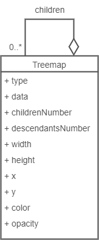

# DENIM Visualization

[](https://gitlab.unamur.be/denim/visualization/-/commits/master)

## 📣 Description

This application enables to visualize a microservices architecture from a data perspective.

## ⭐ Features

Here is a summary of the features currently supported.

### Treemap

#### Description

It transforms a static analysis report logic object into a treemap view object.

#### Implementation status

| Transformation | Implementation status |
| -------------- | --------------------- |
| Treemap        | 🌕                    |

#### How to?

**INPUT**

Invoke the transformation by using the [POST /treemap] (http://localhost:3000/treemap) route with a static analysis report in JSON (obtained from [DENIM Reverse Engineering](https://github.com/DatabaseEvolutionNudgeInMicroservices/reverse-engineering)) inside the request.

**OUTPUT**

Consult the response view object in JSON:

```json
{
  "type": "treemap",
  "data": {
    // ...
  },
  "childrenNumber": <children number>,
  "descendantsNumber": <descendants number>,
  "width": <width>,
  "height": <height>,
  "x": <position on X axis>,
  "y": <position on Y axis>,
  "children": [
    {
      "type": "repository",
      "data": {
        "location": "https://github.com/<user>/<repository>"
      },
      "childrenNumber": <children number>,
      "descendantsNumber": <descendants number>,
      "width": <width>,
      "height": <height>,
      "x": <position on X axis>,
      "y": <position on Y axis>,
      "children": [
        {
          "type": "directory",
          "data": {
            "location": "https://github.com/<user>/<repository>/"
          },
          "childrenNumber": <children number>,
          "descendantsNumber": <descendants number>,
          "width": <width>,
          "height": <height>,
          "x": <position on X axis>,
          "y": <position on Y axis>,
          "children": [
            {
              "type": "file",
              "data": {
                "location": "https://github.com/<user>/<repository>/.../<file path>.js"
              },
              "width": <width>,
              "height": <height>,
              "x": <position on X axis>,
              "y": <position on Y axis>,
              "children": [
                {
                  "type": "codeFragment",
                  "data": {
                    // See CodeFragment class in the static analysis report model
                  },
                  "childrenNumber": 0,
                  "descendantsNumber": 0,
                  "width": 20,
                  "height": 20,
                  "x": 7.5,
                  "y": 7.5,
                  "children": [],
                  "color": "<color>",
                  "opacity": "<opacity>"
                }
              ],
              "color": "<color>",
              "opacity": "<opacity>"
            }
          ],
          "color": "<color>",
          "opacity": "<opacity>"
        }
      ],
      "color": "<color>",
      "opacity": "<opacity>"
    }
  ],
  "color": "#000000",
  "opacity": "0.05"
}
```

## 👩‍💻 Development details

### Setup

See [INSTALL file](INSTALL.md).

### Test the app (manually)

Manual test suites are set up thanks through the [Postman](https://www.postman.com/) tool.

The tests are specified in the `/test/manual` directory and are named following the `*.test.js` pattern.

### Test the app (unit testing)

Unit test suites are set up thanks to the [Jest](https://www.npmjs.com/package/jest) framework.

The tests are specified in the `/test/unit` directory and are named following the `*.test.js` pattern.

The configuration of Jest is stated in the `/package.json` file.

The tests running computes the code coverage.

#### Launching the tests

- Launch the unit tests.

  ```bash
  npm run test_unit
  ```

### Test the app (integration testing)

Integration test suites are set up thanks to the [SuperTest](https://www.npmjs.com/package/supertest) framework.

The tests are specified in the `/test/integration` directory and are named following the `*.test.js` pattern.

The configuration of Jest is stated in the `/package.json` file.

#### Preparing the environment with Docker

- Launch the application on Docker (cf. [Dockerize the application](#dockerize-the-application)).

#### Launching the tests

- Launching integration tests.

  ```bash
  npm run test_integration
  ```

### Documentation

An autogenerated documentation is available thanks to SwaggerUI
at [http://localhost:3000/docs](http://localhost:3000/docs).

- Generate the documentation.

  ```bash
  npm run swagger
  ```

### CI/CD

A CI/CD process is set up thanks to GitLab CI/CD.
Learn more about GitLab CI/CD via [this page](https://docs.gitlab.com/ee/ci/).

This one is described in the `.gitlab-ci.yml`.
⚠️ Right privileges must be granted to Docker on the session on which the CI is executed.

### Linting

- Lint the application.

  ```sh
  npm run lint
  ```

### Formatting

- Formatting the application.

  ```sh
  npm run format
  ```

## 🪛 Technical details

### Technologies

- JavaScript
- Docker

### Libraries

#### Layout

- [bin-pack](https://www.npmjs.com/package/bin-pack) is used for the implementation of the bin packing algorithm.

#### Project configuration

- [expressjs](https://www.npmjs.com/package/express) is a backend NodeJS framework.
- [body-parser](https://www.npmjs.com/package/body-parser) is used for parsing REST API request body.
- [cors](https://www.npmjs.com/package/cors) is used for managing CORS.

#### Tests

- [Jest](https://www.npmjs.com/package/jest) is used for unit testing.
- [SuperTest](https://www.npmjs.com/package/supertest) is used for integration testing.

#### Format

- [eslint](https://eslint.org/) is used for linting the code.
- [prettier](https://prettier.io/) is used for formatting the code.

#### Documentation

- [swagger-autogen](https://www.npmjs.com/package/swagger-autogen) is used for SWAGGER documentation.
- [swagger-ui-express](https://www.npmjs.com/package/swagger-ui-express) is used UI SWAGGER documentation.

### Tools

- [npm](https://www.npmjs.com/) is the package manager used.
- [GitLab CI/CD](https://docs.gitlab.com/ee/ci/) is the CI/CD continuous tool used.
- [Docker Desktop](https://docs.docker.com/desktop/windows/install/) is the containerization technology used.
- [Postman](https://www.postman.com/) is the tool for testing manually the API.

## 🧪 Design details

### Treemap

The treemap follows that model:



## 🤝 Contributing

If you want to contribute to the project, please consider the following instructions:

- Any contribution must be tested (unit and integration tests).
- All the tests and the CI/CD pipeline must pass before definitively integrating the contribution.
- Any contribution must be documented, especially by updating the `README.md` and the `INSTALL.md` file.
- Any contribution must be approved via the pull request mechanism.
- More generally, any contribution must follow the conventions and keep the shape of previous contributions.

## 📊 Evaluation

The complete data of our evaluation is detailed in the [`/evaluation`](https://github.com/DatabaseEvolutionNudgeInMicroservices/visualization/tree/main/evaluation) folder. It contains static analysis JSON files used as input to our approach and treemap SVG files generated based on our approach. PDF file also puts into context the choice of the two versions of Overleaf targeted for the case study.
